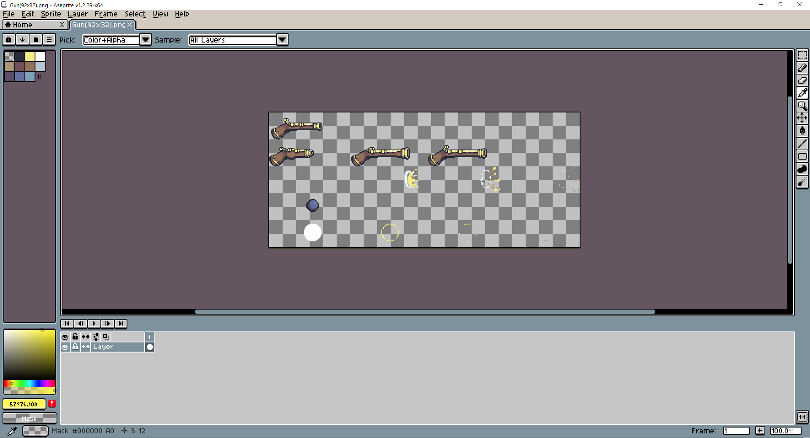
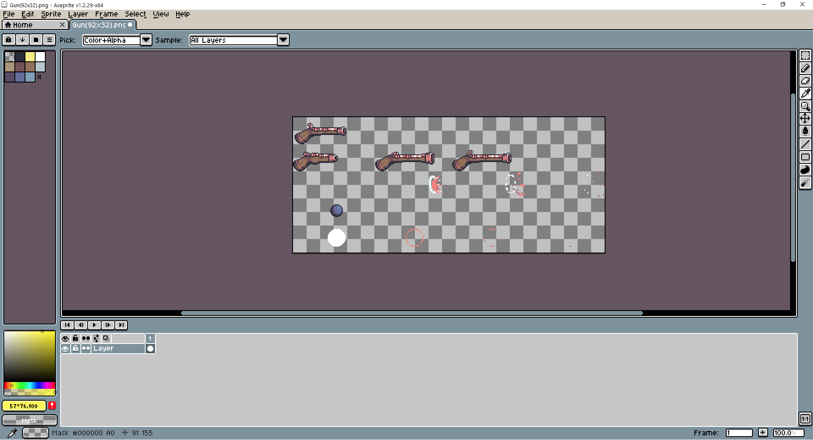

# Simple Gun Weapon

This section will walk through the process of adding a new gun weapon to Fish Fight, using a sniper weapon as an example.

## Planning

Before jumping into the games code, it is a good idea to do some planning about what you want your new weapon to do. I determined that my sniper weapon should have the following properties:

- High bullet speed
- Large recoil
- 2 bullets

## Implementation

Open your cloned "FishFight" directory using your code editor of choice.

### The item definition

To add an item or, in this case, a weapon to the game, you will first have to define the item in a data file. These files are located in
`assets/items` and will typically have the same name as the item's id. Since we are creating a sniper rifle, we can give this file the 
name `sniper_rifle.json`. This path to the file must also be added to the file `assets/items.json`, so that game will know where to look
for it. This is done by simply adding the path to the file, relative to the `items.json` file, to the array within. In this case, the path
that we add will be `items/sniper_rifle.json`.

Now, it is time to define the weapons parameters inside the `items.json` file. Begin by creating a new object and adding
the id (`sniper_rifle`) and the item type (`weapon`).

Every item that we add will also need a set of sprite parameters (`SpriteParams`) that define the sprite that will be drawn
when the item is on the ground, before being picked up by the player. Typically, it will be enough to include a texture id here,
as things like sprite size will most often be defined in the texture's entry in the `assets/textures.json` file.

We will also need to define a collider size, that will be the size of the collider used when checking if a player is close enough
to the item to pick it up:

```json
{
  "id": "sniper_rifle",
  "type": "weapon",
  "sprite": {
    "texture": "musket"
  },
  "collider_size": {
    "x": 16,
    "y": 16
  }
}
```

That is all the required data for the item part of our definition, so now it is time need to add the parameters required for weapon item variants.

We have quite a few options for customization here that can be explored by looking at the `WeaponParams` struct in the source code. We are required 
to define at least the `WeaponEffectParams`, which holds the parameters of the effect that will be instantiated when the weapon is used to attack,
and a `WeaponAnimationParams`, which holds the parameters of the animation players that will be used to animate and draw the weapon when it is
equipped. We also wanted our rifle to have two bullets and a heavy recoil, so we should also define these parameters. We should also specify a
cooldown for our weapon, which governs the interval between shots, and an attack duration, which controls the length of time that the player is
locked in the attack state (input blocked), after an attack. We should also add a sound effect, to be played when the weapon is used. We will also
have to add an effect offset, which is the offset from the weapons position to the point where the weapons effect will originate.

Now, it is time to define the parameters for the affect that will be instantiated when we fire the gun. There are several variants to
choose from, or a new one can be implemented, either as a new variant of `WeaponEffectKind` or as an implementation of the `WeaponEffectCoroutine`
type. In our case, however, there is already a perfect fit; the `Projectile` variant.

We will want to specify a projectile speed, a projectile range and a specification for how the projectile should be drawn. A projectile can be
drawn as a simple colored shape or using a texture. We will use a texture and we will also color the projectile by setting a tint:

```json
{
  "id": "sniper_rifle",
  "type": "weapon",
  "sprite": {
    "texture": "musket"
  },
  "uses": 2,
  "cooldown": 1.5,
  "attack_duration": 1.0,
  "recoil": 1400.0,
  "sound_effect": "shoot",
  "collider_size": {
    "x": 64,
    "y": 24
  },
  "effect_offset": {
    "x": 64,
    "y": 16
  },
  "effect": {
    "type": "projectile",
    "projectile": {
      "type": "sprite",
      "sprite": {
        "texture": "small_projectile",
        "size": {
          "x": 8,
          "y": 4
        },
        "tint": {
          "r": 0.9,
          "g": 0.75,
          "b": 0.12,
          "a": 1.0
        }
      }
    },
    "range": 600.0,
    "speed": 25.0
  },
  "animation": {
    "texture": "musket",
    "animations": [
      {
        "id": "idle",
        "row": 0,
        "frames": 1,
        "fps": 1
      },
      {
        "id": "attack",
        "row": 1,
        "frames": 3,
        "fps": 15
      }
    ]
  },
  "effect_animation": {
    "texture": "musket",
    "animations": [
      {
        "id": "attack_effect",
        "row": 2,
        "frames": 4,
        "fps": 12
      }
    ]
  }
}
```

## Texture

It is important to make sure that your weapon is able to be visually distinguished between the other weapons in the game. When I added the sniper rifle to the `ITEMS` array, I copied all of the data from existing musket weapon, changing only the `tiled_name` and `constructor`. To give my sniper weapon a new texture, I will also need to change the `gun` texture in the `textures` field. Currently, the `gun` texture is set to `assets/Whale/Gun(92x32).png`. I'll open this file with my pixel editor of choice, [Aseprite](https://www.aseprite.org/) ([GIMP](https://www.gimp.org/) would also work fine).



I don't consider myself an artist so I'm just going to modify the hue of the golden part of the gun texture to a reddish color. First I'll select a color range and adjust the threshold to select only the golden part of the gun texture.


Then I'll adjust the hue of the selected colors to turn all of the gold color red.



This texture is now distinguishable from the other gun textures in the game.

This, of course, is just one way of distinguishing the texture from the other textures in the game. Feel free to copy and modify textures using your own methods, or if you feel inclined, make your own unique texture for your weapon!

Now, all that remains is to add the new texture to the game. This is done by copying the texture file to the `assets/textures/items` directory and adding an entry to the file `assets/textures.json`.

Assuming a texture file name of `SniperRifle(92x32).png`, the following entry should be added to `assets/textures.json`:

```json
{
  "id": "sniper_rifle",
  "path": "textures/items/SniperRifle(92x32).png",
  "type": "spritesheet",
  "sprite_size": {
    "x": 92,
    "y": 32
  }
}
```

You will also have to change your weapons data file, so that it references this new texture, in stead of `"musket"`. This is done by changing the `texture` fields of your weapons `sprite` and `animation` members to `"sniper_rifle"`.

## Testing

The last thing we need to do is put our new weapon in the game and test it! Fish Fight's levels are defined in json files in the `assets/maps` directory. For testing items, there is a test level in the game defined in a file called `test_level.json`. Open this file.

In this file you will see a long list of item entries containing data about items that are placed in the level. The easiest way to add your new weapon to this level is to replace the `name` field of one of other items currently in the level with the id of your new weapon (referred to as `your_weapon` throughout this chapter). Here is the entry for my sniper weapon.

```json
...
{
    "draworder":"topdown",
    "id":5,
    "name":"items",
    "objects":[
        ...
        {
            "height":0,
            "id":147,
            "name":"sniper",
            "point":true,
            "rotation":0,
            "type":"item",
            "visible":true,
            "width":0,
            "x":400,
            "y":690
        },
        ...
    ],
    ...
}
```

If you followed all of these steps correctly, your new weapon should be in the game. Run the game using `cargo run`, then select the test level. You should see your gun in the level and be able to try it out.


Now all you need to do is modify the values in `src/items/your_weapon.rs` until the weapon feels right to you! Then you are ready to make a pull request.
